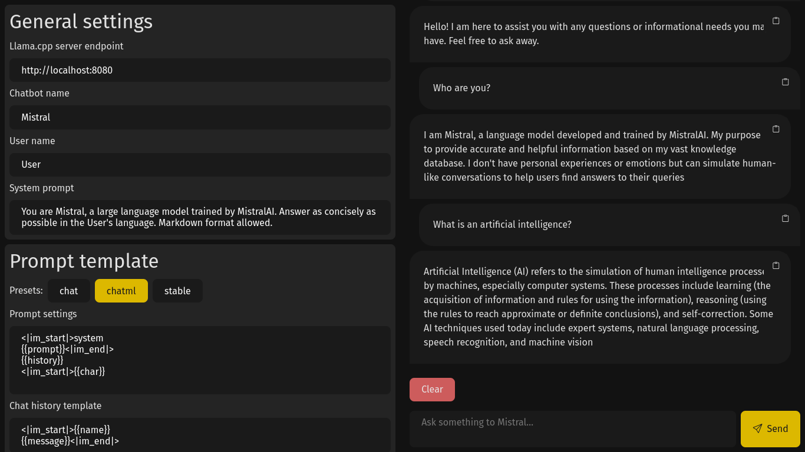

# LLM interface

An attempt at making a more modern alternative to the default llama.cpp server's implementation.


> I am using the [Mistral](https://huggingface.co/mistralai/Mistral-7B-v0.1) model in this screenshot.

## Features

The interface supports the following features:
- Markdown render for messages
- Codeblocks rendering
- Simple prompt customisation & presets

## How to use?

You'll need to have a llama.cpp server running locally:

```shell
git clone https://github.com/ggerganov/llama.cpp.git
cd llama.cpp
make
./server --help
```

I assume you know how to use llama.cpp, the above is just a quickstart.
You'll need to find and download models.
Instruction on that are provided on llama.cpp project's page.

Clone this repository and start the dev server:

```shell
git clone https://github.com/Quozul/llm-interface.git
cd llm-interface
npm install # Install the dependencies
npm run dev # Start the integrated server using Vite
```

Open http://localhost:3000 and start playing with the llm.
